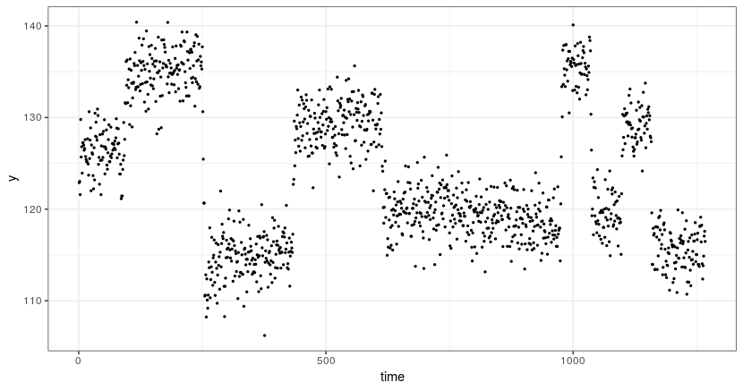
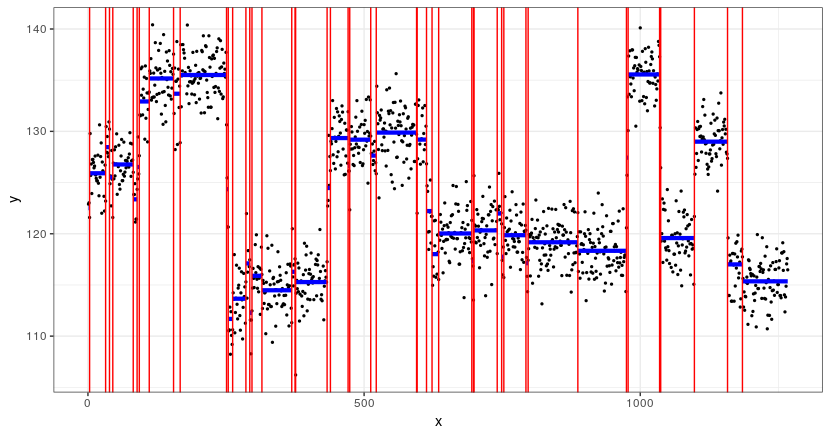

# FpopPSD

## Installation Notes 

### Step 1: Install the devtools package

```
install.packages("devtools")
```

### Step 2: Install the FpopPSD package from GitHub

```
library(devtools)
install_github("aLiehrmann/FpopPSD")
```

### Step 3: Load the package

```
library(FpopPSD)
```

## Quickstart

```{r}
df <- read.table("quickstart_data/wellLogData.txt", header = T)
ggplot(df, aes(x=time, y=y))+
  geom_point(size=0.5)+
  theme_bw()
```



```
n = length(df$y)
beta <- 2.5
alpha <- 10 + beta * log(n)
res <- FpopPSD::fpopPSD(df$y, beta, alpha)
res$changepoints
```

```
 [1]    3   32   39   45   82   89   93  111  155  167  251
[12]  254  262  286  293  297  315  369  375  376  433  439
[23]  471  474  512  522  595  596  613  623  635  695  698
[34]  699  741  749  753  793  797  887  975  978 1035 1037
[45] 1098 1158 1185
```

```
FpopPSD::plot_seg(res$changepoints, df$y, df$time)
```


## Rstudio

```{r}
microbenchmark(fpopPSD(rnorm(10^5), 2.5, 10+2.5*log(10^5), "rand_one", 1, rep(1,10^5)), times=10)
```

### -> standard
```
Unit: seconds
                                                                              expr
 fpopPSD(rnorm(10^5), 2.5, 10 + 2.5 * log(10^5), "rand_one", 1,      rep(1, 10^5))
      min       lq     mean   median       uq      max neval
 1.772096 1.829262 1.850465 1.855723 1.879737 1.898676    10
```

### -> Doubly_Linked_List + array_of_candidates
```
Unit: seconds
                                                                              expr
 fpopPSD(rnorm(10^5), 2.5, 10 + 2.5 * log(10^5), "rand_one", 1,      rep(1, 10^5))
      min       lq     mean  median       uq      max neval
 2.083051 2.112874 2.143142 2.13984 2.169943 2.215169    10
```

### -> Singly_Linked_List + array_of_candidates

```
Unit: seconds
                                                                              expr
 fpopPSD(rnorm(10^5), 2.5, 10 + 2.5 * log(10^5), "rand_one", 1,      rep(1, 10^5))
      min       lq     mean   median       uq      max neval
 2.153212 2.175025 2.287709 2.207098 2.269635 2.635958    10
```

##Rconsole

### -> standart
```
Unit: seconds
                                                                              expr
 fpopPSD(rnorm(10^5), 2.5, 10 + 2.5 * log(10^5), "rand_one", 1,      rep(1, 10^5))
      min       lq    mean   median       uq      max neval
 1.280487 1.289882 1.30568 1.296986 1.323208 1.339936    10
```

### -> Doubly_Linked_List + array_of_candidates
```
Unit: seconds
                                                                              expr
 fpopPSD(rnorm(10^5), 2.5, 10 + 2.5 * log(10^5), "rand_one", 1,      rep(1, 10^5))
      min       lq    mean   median       uq      max neval
 1.603065 1.609618 1.74338 1.760211 1.839596 1.915139    10
```

### -> Singly_Linked_List + array_of_candidates
```
Unit: seconds
                                                                              expr
 fpopPSD(rnorm(10^5), 2.5, 10 + 2.5 * log(10^5), "rand_one", 1,      rep(1, 10^5))
      min       lq     mean   median       uq     max neval
 1.480823 1.511765 1.574559 1.557891 1.656015 1.68184    10
```